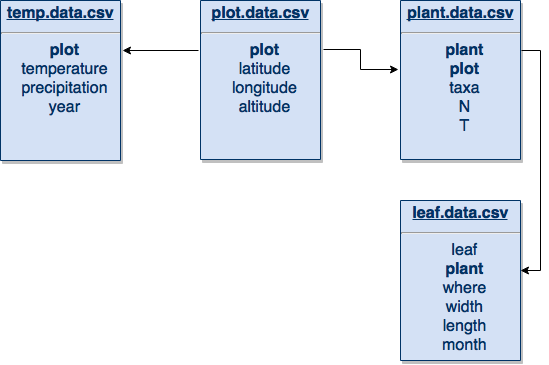

lez01: Introduzione al corso - L'analisi dei dati - Approccio alle statistiche
================

-   [Perché stiamo facendo questo corso?](#perché-stiamo-facendo-questo-corso)
    -   [Cosa ci si aspetta dagli studenti e chi lo dovrebbe insegnare:](#cosa-ci-si-aspetta-dagli-studenti-e-chi-lo-dovrebbe-insegnare)
-   [Replicabilità](#replicabilità)
    -   [La scienza come somma di test riproducibili](#la-scienza-come-somma-di-test-riproducibili)
    -   [Materiali e Metodi VS Analisi Point & Click](#materiali-e-metodi-vs-analisi-point-click)
    -   [Come si risolve il problema?](#come-si-risolve-il-problema)
    -   [FAQ](#faq)
-   [Collaborazione](#collaborazione)
    -   [Il primo dei problemi: io non parlo sloveno, tantomeno lo leggo](#il-primo-dei-problemi-io-non-parlo-sloveno-tantomeno-lo-leggo)
    -   [2: le mille versioni di un file](#le-mille-versioni-di-un-file)
    -   [3: chi sta lavorando a cosa](#chi-sta-lavorando-a-cosa)
-   [Manutenzione](#manutenzione)
    -   [Tutto il processo deve essere aggiornabile](#tutto-il-processo-deve-essere-aggiornabile)
    -   [LA DOCUMENTAZIONE](#la-documentazione)
-   [L'analisi dei dati](#lanalisi-dei-dati)
    -   [Data Harvesting](#data-harvesting)
    -   [Data Carpentry](#data-carpentry)
    -   [Machine Learning](#machine-learning)
    -   [Data Visualization](#data-visualization)
-   [Statistica descrittiva](#statistica-descrittiva)
-   [Statistica inferenziale](#statistica-inferenziale)
-   [Statistica predittiva](#statistica-predittiva)
-   [Hypotesis Testing](#hypotesis-testing)
-   [La gestione dei dati](#la-gestione-dei-dati)
    -   [Copie, copie, copie](#copie-copie-copie)
    -   [I dati originali](#i-dati-originali)
    -   [I dati grezzi](#i-dati-grezzi)
    -   [La correzione dei file](#la-correzione-dei-file)
    -   [I dati su cui fare le analisi](#i-dati-su-cui-fare-le-analisi)
-   [Materiale e approfondimenti](#materiale-e-approfondimenti)
    -   [Note](#note)

Perché stiamo facendo questo corso?
-----------------------------------

##### Cosa ci si aspetta dagli studenti e chi lo dovrebbe insegnare:

| Materia                 | Competenza                    |
|-------------------------|-------------------------------|
| Statistica              | Quali dati raccogliere        |
| **Materie specifiche**  | **Come si raccolgono**        |
| Data Management         | Digitalizzare i dati raccolti |
| Data Carpentry          | Elaborare praticamente i dati |
| Statistica descrittiva  | Riassumere i contenuti        |
| Statistica inferenziale | Individuare i legami causali  |

Replicabilità
-------------

##### La scienza come somma di test riproducibili

Per qualsiasi analisi scientifica il punto principale è la possibilità di essere ripetuta (e fornire risultati analoghi) da altri operatori in possesso delle adeguate abilità. In particolare è necessario, in uno studio di tipo scientifico, fornire tutti i dettagli necessari a replicare le analisi svolte.
Questa funzione è normalmente svolta dalla sezione "Materiali e Metodi" degli articoli scientifici e delle tesi.

##### Materiali e Metodi VS Analisi Point & Click

Se di un'analisi di laboratorio è possibile specificare passo passo tutte le operaizoni svolte, i reagenti utilizzati, ed i macchinari, questo diventa quasi impossibile per le elaborazioni dei dati: Il numero di passi, dall'apertura dei file al settaggio delle impostazioni dei grafici, rende impossibile una tracciatura univoca del processo, e quindi la riproduzione dei risultati ottenuti. Se questa sembra un'esagerazione o una pignoleria, si può provare a riprendere in mano una qualsiasi elaboraizone di 3 anni prima e chiedere a chi l'ha fatta di ripeterla, e poi ridere. Il problema è spesso generato dalla complessità crescente sia dei dati, sia delle analisi che su questi dati vengono svolte.

##### Come si risolve il problema?

Automatizzando tutti i processi, dall'inizio alla fine.
Questo però prevede l'acquisizione di una serie di competenze nuove e di familiarità con una serie di strumenti che non fanno parte storicamente del nostro bagaglio.
Queste competenze possono però essere mutuate dall'informatica, che si è scontrato con gli stessi problemi decine di anni prima. Tutto sta nel trovare degli strumenti che rendano un po' meno problematica l'adozione delle soluzioni che l'informatica ha adottato già da decenni.

#### FAQ

##### Perché non EXCEL

-   I dati con cui stiamo lavorando sono troppi per il programma
-   la complessità delle operazioni rende le cose troppo complicate
-   Il programma, *per quanto non ci pensiamo*, non è gratuito
-   Le analisi più complesse sono semplicemente infattibili, richiedendo l'appoggio ad altri software
-   I passaggi (selezionare, spostare, copiare e incollare) sono un incubo da automatizzare
-   Se non automatizzati rendono il tutto assolutamente irriproducibile (e spesso non modificabile)

##### Perché non Python

-   Questa è "quasi" solo una scelta di gusti
-   Python, per quanto ancora più versatile, e proprio per quel motivo, richiede un approccio ancora più orientato all'informatica
-   Idealmente *potrebbe essere una buona scelta imparare entrambi i linguaggi*, anche se il settore delle scienze applicate non si giova particolarmente della versatilità di Python

Collaborazione
--------------

##### Il primo dei problemi: io non parlo sloveno, tantomeno lo leggo

La collaborazione, nel mondo accademico ma non solo, passa prima di tutto da un linguaggio comune, che non dovrebbe mai essere dato per scontato: *fate un punto d'onore di utilizzare solo l'inglese per ogni cosa relativa ai vostri studi*, qualsiasi materiale prodotto, qualsiasi dato raccolto. E ringraziate il cielo che la lingua della comunità scientifica non sia più il latino.

##### 2: le mille versioni di un file

Anche lavorando da soli ci si può trovare a salvare decine di versioni dello stesso file di testo, per segmentarlo in diversi file quando cresce troppo, per finre con dei raccapriccianti archivi .zip di intere cartelle. Questo, quando si collabora in più persone allo stesso progetto, aumenta in modo esponenziale, mentre si aggiunge un altro problema:

##### 3: chi sta lavorando a cosa

Va tutto bene finché non si scopre di aver lavorato due giorni su un file che qualcun altro ha nel frattempo reso completamente irrilevante.

Questo è uno dei motivi per cui si **consiglia fortemente** [1](#f1) l'utilizzo del version control anche per i file che non contengono codice, e si ricorda che **NON È POSSIBILE METTERE SOTTO VERSION CONTROL FILE DI WORD**. Il formato Markdown, in particolare quello di R, permette in modo semplice di generare dei PDF estremamente funzionali e al contempo non impazzire con LaTeX.

Manutenzione
------------

##### Tutto il processo deve essere aggiornabile

Aggiornabile con il minimo sforzo, il che richiede che tutto, **tutto**, sia scomposto nelle più piccole unità funzionali possibili, in modo da poterle rimpiazzare, correggere, aggiornare, espandere, senza dover rimettere le mani all'intero progetto.

##### LA DOCUMENTAZIONE

Ritornare su un progetto a distanza di settimane (quando non sono anni), può essere un'esperienza illuminante: spesso risulta più semplice ricostruire tutto da capo che non effettuare una piccola variazione. Il primo dei motivi per cui questo succede è l'assenza di documentazione: cioé di file dove sono spiegati tutti i termini, le abbreviazioni, le unità di misura, le scelte che sono state fatte. Mentre buone pratiche di scrittura (come l'identazione del codice, la scelta dei nomi per le variabili, ecc) si apprendono fondamentalmente con la pratica, una documentazione rigorosa può essere autoimposta attraverso alcune tecniche più avanzate, in primi un Versioning costante (ed altre che al momento esulano dagli scopi di questo corso, in particolare la creazione di `package` con RStudio).

L'analisi dei dati
------------------

L'analisi dei dati (alla fin fine il centro di tutto questo corso) sta diventando sempre più una disciplina a se, all'interno dei differenti rami delle scienze: la mole di dati aumenta costantemente, le metodologie e le tecnologie per ottenerne informazioni idem. Tutto questo al momento va sotto il nome di *Data Science*, che comprende diverse fasi, ognuna a quanto pare con un suo nome e i suoi specialisti: *Data Harvesting*, *Data Carpentry*, *Machine Learning*, *Data Visualization*.

##### Data Harvesting

L'unica fase che non tratteremo nel nostro corso, ha un'importanza fondamentale però nelle applicazioni GIS. Nel resto dei campi di interesse forestale normalmente la raccolta dei dati viene effettuata in campo.

##### Data Carpentry

Sebbene il termine non si sia ancora pienamente stabilito, normalmente indica tutte quelle operazioni sui dati che permettono di passare dalle tabelle di dati grezzi ad una struttura ordinata che agevoli poi le analisi. Questa parte del lavoro è, in ordine di tempo e di sforzi, la parte principale del lavoro con i dati, sottovalutarne l'importanza è il più comune degli errori che commette chi studia queste materie senza passare subito alla pratica.

##### Machine Learning

Sotto questo grande ombrello ricadono praticamente tutte le tecniche statistiche che ci permettono di identificare le strutture all'interno dei dati, dalle più semplici regressioni lineari a tecniche molto complesse.

##### Data Visualization

Questo è normalmente un altro grande punto debole dell'analisi dei dati: la visualizzazione, punto chiave della comunicazione dei risultati, permette non solo di comprendere e scoprire il contenuto dei dati che abbiamo raccolto, ma anche di veicolarlo ad altri. Per questo, insieme alle tecniche di comunicazione rappresenta probabilmente il cardine di tutta l'analisi, che viene svolta proprio per arrivare più chiaramente possibile ai propri dstinatari.

Statistica descrittiva
----------------------

La statistica descrittiva si occupa di rappresentare in un modo comprensibile moli di dati altrimenti difficili da considerare nella loro interezza. In questo senso può essere vista come una collezione di tecniche di sintesi. Le tecniche possono essere anche molto complesse, ma si sviluppano in un ordine piuttosto lineare sopra tecniche più semplici. Il 90% della statistica nelle applicazioni forestali è statistica descrittiva, sia nel senso più descrittivo, sia nella fase di analisi esplorativa.

Statistica inferenziale
-----------------------

La statistica inferenziale si occupa di identificare i legami di causa-effetto all'interno dei dati reccolti. Questo tipo di analisi raramente possono essere svolte al di fuori di disegni sperimentali di laboratorio.

Statistica predittiva
---------------------

Hypotesis Testing
-----------------

Il cuore della statistica scientifica è la capacità di testare un'ipotesi sui dati, nella quasi totalità dei casi si tratta di verificare statisticamente che la struttura dei dati non sia casuale. Il punto chiave da ricordare è che se si vuole davvero testare un'ipotesi non si può fare **nessun'altro tipo di statistica sui dati**, almeno *non prima dei test*. Una buona pratica sarebbe quella di stabilire l'ipotesi ed i metodi per testarla ancora prima di raccogliere i dati.

------------------------------------------------------------------------

Ok, cambiamo argomento...

------------------------------------------------------------------------

La gestione dei dati
====================

L'argomento è critico, per questo lo affrontiamo subito, con delle linee guida che da principio possono essere seguite abbastanza pedissequamente:

### Copie, copie, copie

I dati (e tutte le elaborazioni per quel che ci riguarda), dovrebbero esistere in **almeno 3 copie**, in **almeno 2 luoghi fisici** diversi. La prassi per noi sarà: una copia sul computer, una sul cloud (per i dati di partenza sia GitHub, DropBox, BOX, o Google Drive non importa), e un backup completo (almeno mensile) del computer su un Hard Disk esterno.

-   **NO** CD-DVD riscrivibili o meno
-   **NO** e-mail (se i dati sono pochi)
-   **NO** chiavi USB o roba che vada persa
-   **NO** backup tenuti insieme al computer (normalmente nei furti sparisce tutto)

I dati originali
----------------

Nei nostri ambiti di interesse i dati originali sono normalmente su un foglio di carta: che sia il blocco di appunti del laboratorio o le schede dei rilievi di campo, normalmente questi vengono registrati a matita[2](#f2), con tutta una serie di note a margine, eccezioni, punti interrogativi. Questi dati dovrebbero essere conservati *come sono*, in una cartella con su scritto progetto e data, fotografati e trattati come tutti i dati digitali. Una regola valida sarebbe *non utilizzare dei dati per studi non previsti durante la loro raccolta*. Questo è vero specialmente per i dati di laboratorio, quindi i dati cartacei possono essere distrutti **una volta portato a termine lo studio**. Per i dati di campo, le fotografie, le osservazioni, le note a margine, prese durante i sopralluoghi, queste dovrebbero essere trattate con più cura e conservate, poiché non possiamo sapere quali di quelle informazioni potrebbero essere preziose domani, e quello che noi riusciamo a vedere non è sempre quello che riescono a vederci gli altri.

Questi dati vengono trasferiti per le analisi sui files che noi chiameremo *dati grezzi*, o *raw data*.

I dati grezzi
-------------

I dati grezzi devono essere pure e semplici trascrizioni dei dati originali, strutturati in un modo semplice e facili da controllare: una pratica può essere la seguente

1.  identificare i livelli principali a cui appartengono i dati, questi normalmente sono un numero limitato:
    -   livello di foglia
    -   livello di pianta
    -   livello di plot/vaso
    -   livello di sito/serra
    -   livello regionale
2.  creare un file singolo per ogni livello
3.  i dati vanno inseriti per riga: ogni colonna rappresenta una grandezza misurata, ogni riga una misura di quella grandezza. La prima colonna va laciata come ID della misura, la seconda come collegamento al livello superiore
4.  i dati vanno inseriti senza unità di misura (le unità di misura vanno specificate nella documentazione)
5.  i dati mancanti dovrebbero essere inseriti come **NA**, o (meno volentieri) come caselle bianche. Attenzione a non inserire **0** su misure non prese
6.  le misure ripetute vanno considerate come una nuova misura
7.  il separatore dei decimali è **il punto, non la virgola**

Esercizio: trovate le differenze

<h2>
NO
</h2>
PIANTA n°2.xlsx

| foglia | zona    | larghezza.marzo | lunghezza.marzo | larghezza.aprile | lunghezza.aprile |
|--------|---------|-----------------|-----------------|------------------|------------------|
| 2-01   | rosetta | 3,4 cm          | 1,3 cm          | 5,2 cm           | 2,0 cm           |
| 2-02   | stelo   | 0               | 1,3 cm          | 0                | 0                |

<h2>
SI
</h2>
leaf\_data.csv

| leaf | plant | where   | width | length | month |
|------|-------|---------|-------|--------|-------|
| 01   | 02    | rosette | 3.4   | 1.3    | 3     |
| 01   | 02    | rosette | 5.2   | 2.0    | 4     |
| 02   | 02    | stem    | NA    | 1.3    | 3     |

**leaf\_data\_legend.csv**

| col    | notes                                                              |
|--------|--------------------------------------------------------------------|
| leaf   | numeric: ID of the leaf                                            |
| plant  | numeric: ID of the plant                                           |
| where  | str: position of the leaf (rosette, stem, bulb)                    |
| width  | numeric: unit=cm , precision ±0.1 cm, measured in the widest point |
| length | numeric: unit=cm , precision ±0.1 cm, measured without the stalk   |
| month  | numeric: 1=Jan., 2=Feb. ecc, measured the first day of each month  |

A questo punto seguirà una tabella con tutte le piante:

**plant\_data.csv**

| plant | plot | taxa   | N   | T   |
|-------|------|--------|-----|-----|
| 01    | 01   | ROSPEN | 3   | 1   |
| 02    | 01   | ASPTEN | 5   | 1   |
| 03    | 01   | BRASYL | 3   | 1   |

**plant\_data\_legend.csv**

<table style="width:17%;">
<colgroup>
<col width="8%" />
<col width="8%" />
</colgroup>
<thead>
<tr class="header">
<th>col</th>
<th>notes</th>
</tr>
</thead>
<tbody>
<tr class="odd">
<td>plant</td>
<td>numeric: ID of the plant</td>
</tr>
<tr class="even">
<td>plot</td>
<td>numeric: ID of the leaf</td>
</tr>
<tr class="odd">
<td>taxa</td>
<td>str: six letter code ROSPEN = <em>Rosa pendulina</em> ASPTEN = <em>Asparagus tenuifolius</em> BRASYL = <em>Brachipodium sylvaticum</em></td>
</tr>
<tr class="even">
<td>N</td>
<td>numeric: unit=g/l , Nitrium concentration in the irrigation water</td>
</tr>
<tr class="odd">
<td>T</td>
<td>numeric: treatment 1=sunlight 2=half-shade 3=shade</td>
</tr>
</tbody>
</table>

Se una delle legende è più una traduzione di codici, come nel caso dei nomi delle piante, è opportuno preparare una tabella apposita (detta *lookup table*) con solo le due colonne: "codice" e "traduzione", normalmente indicate come **"key"** e **"value"**.

Sarebbe bellissimo se questi dati fossero collegati da uno schema delle loro relazioni[3](#f3):

**P.S.**: lo schema va benissimo anche fatto a mano e fotografato! È importante però come fase preliminare per chi organizza i dati e molto comodo a distanza di tempo per riprendere in mano il lavoro.

Tutto questo processo di divisione dei dati si chiama *normalizzazione*, non c'è bisogno che sia portato all'estremo: se dei taxa noi prendiamo in considerazione solo le famiglie, possiamo aggiungere la famiglia alla colonna della pianta, ma appena le cose si complicano è meglio considerare se sia il caso di scomporre ulteriormente i dati.

Una volta inseriti, i dati grezzi **non devono più essere toccati**, può essere una buona regola impostare i diritti dei file direttamente su "sola lettura". Tutti i passaggi da questi dati ai dati da analizzare saranno scritti su script, in modo che tutto quello che viene dopo sia ricostruibile automaticamente.

La correzione dei file
----------------------

> Tutti i database giusti si somigliano, ogni database sbagliato è un casino a modo suo.[4](#f4)

A questo punto i dati grezzi avranno probabilmente bisogno di una notevole quantità di tempo per essere puliti, uniformati, corretti. Se qualcuno avesse l'idea di sottovalutare questa fase la stima normale è che si tratti normalmente del 70% del lavoro. Fortunatamente R è un ambiente eccellente per questi scopi, sfortunatamente è quasi impossibile prevedere il delirio a cui andrete incontro. Per i casi più comuni velidi strumenti sono già stati sviluppati, e di nuovi ne possono essere approntati in caso si trovino casi ricorrenti, come la correzione automatica dei taxa botanici, sia per errori di ortografia che per sinonimi non più in uso.

Il controllo degli errori qui è un serio problema: è difficile notare un "1.o" al posto di "1.0", vedremo poi come assicurarsi che questo non avvenga.

I dati su cui fare le analisi
-----------------------------

A questo punto, quando tutti i dati sono stati corretti, andrà scritto il programma che li mette tutti insieme, in una tabella unica, con un sacco di caselle uguali (ad esempio la latitudine di ogni foglia di una pianta). Su questa tabella saranno fatte le analisi. Vedremo come questo passaggio sia tutto sommato semplice e indolore.

------------------------------------------------------------------------

------------------------------------------------------------------------

[Syllabus](../README.md) &lt;---&gt; [lez02](/lez02/)

------------------------------------------------------------------------

Materiale e approfondimenti
===========================

[GitHub - Fork e Pull Request for dummies](https://www.chronicle.com/blogs/profhacker/forks-and-pull-requests-in-github/47753)

[Ten commandments for good data management](https://dynamicecology.wordpress.com/2016/08/22/ten-commandments-for-good-data-management/)

#### Note

<i id="f1" >1</i> [Eccellente risorsa sul versioning in (anche per i file di solo testo) e sull'utilizzo di GitHub per principianti (e non)](https://programminghistorian.org/lessons/getting-started-with-github-desktop#why-version-control-text-documents) [↩](#a1)

<i id="f2" >2</i> [Come tenere un quaderno di laboratorio](https://colinpurrington.com/tips/lab-notebooks) [↩](#a2)

<i id="f3" >3</i> [Il sito con cui è stato disegnato il diagramma](https://www.draw.io) [↩](#a3)

<i id="f4" >4</i> Vergogna! Che siete venuti a cercare la citazione! [↩](#a4)
