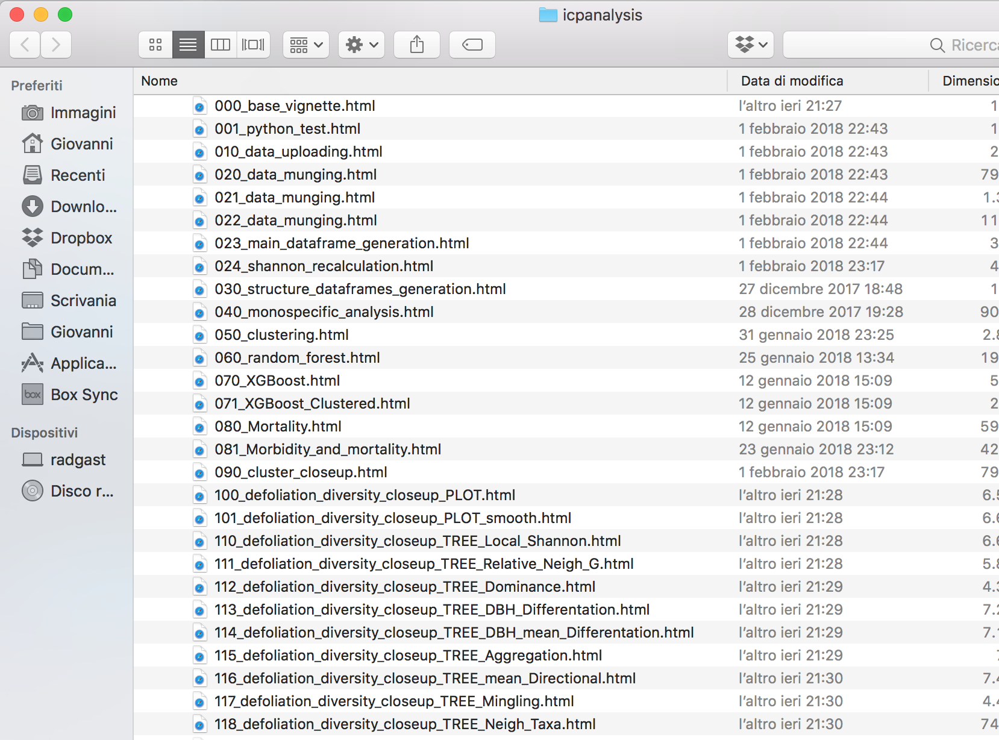
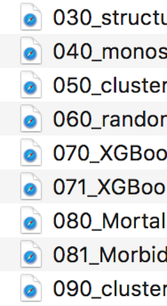

## Dato che i nomi contano:

#### NO
relazionefinale.pdf

#### SI

2018-02-20_relazione-esame-biodiversita.pdf

---

#### NO
i file Michè sono un po' pieni di spazi e accenti.pdf

#### SI

i-file-di-miche-vanno-un-po-meglio.pdf

#### TOP

micheles-files-are-gettin-better.pdf

---

#### NO

fig 1.jpg

#### SI

fig01_boxplot-siti-vs-specie.jpg

#### TOP

fig01_boxplot_sites-vs-species.jpg

---

#### I nomi dei files devono:

Essere letti dalle macchine

Essere letti dagli umani

Lasciarsi ordinare facilmente

#### Basta evitare:

* spazi
* punteggiatura
* accenti
* maiuscole

e per favore, imparate a usare i delimitatori coscentemente:

trattino ( - ) per separare le parole
underscore ( _ ) per separare i concetti (date da nomi da codici)

Se non avete concetti da separare potete usarne anche uno solo (sempre quello).

#### Si può fare: 

Che cartella vorreste vedere alle 3 di notte il giorno prima di una scadenze?

Ok, questa cartella l'ho fatta prima di trovare queste slides, c'è ancora spazio per migliorare...

#### Date:

Santo cielo, c'è addirittua un ISO! 

#### Numeri:

Prevedete l'ordine di grandezza dei numeri che vi serviranno, non è **MAI** 9.

Quindi in generale i numeri hanno uno zero davanti,
e magari anche uno zero dopo, in modo da poter aggiungere un file (9) in posizione intermedia fra due, senza dover rinominare tutto.

Fidatevi **capita**.

## E adesso?

Se iniziate adesso nel giro di un mese diventerà un'abitudine... e tutto sarà magicamente più facile!

Buona fortuna!

---

[Syllabus](../README.md) <---> [lez98](/lez98/)

---

Tutto questo è basato/copiato/tradotto dalle [slides](https://speakerdeck.com/jennybc/how-to-name-files) di [Jennifer Bryan]() 